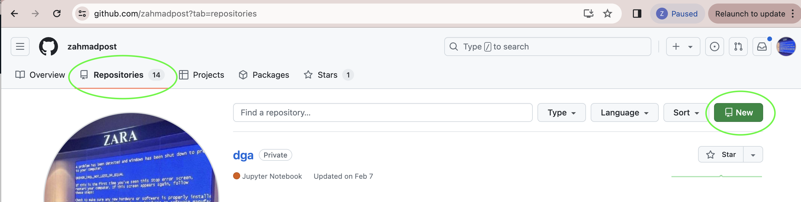
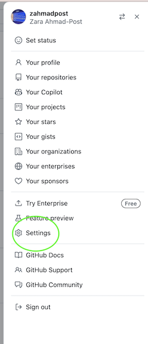
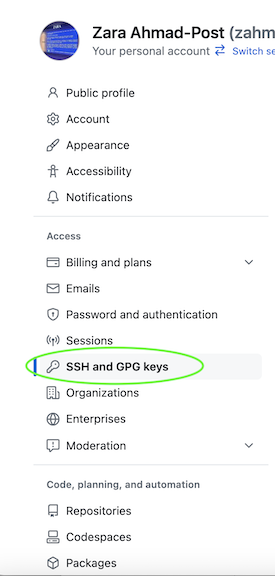
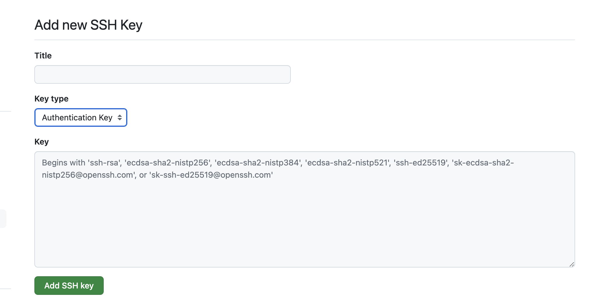

[](https://classroom.github.com/a/sfVqW_-3)
# Week 1 Assignment: Getting Started

In this assignment, you will be setting up your local development environment, creating the accounts that you need to use throughout the semester, and configuring access to these accounts so that you can work with them programmatically! 

Everyone’s local development (dev) environment will be slightly different. You’ll find the tools that work best for you as you progress throughout your career! This dev environment set up is designed to help us have minimal variation during the class so that bugs are easier to fix, and help is easier to provide. 

If you follow all of these instructions, you should have everything you need to get started on next week’s assignment, and hit the ground running. 

If you come from a more technical background, and have already formed strict opinions and preferences about your dev environment, you are welcome to use the tooling that you prefer. That said, should you run into issues related to your dev environment, the MIS547 Instructor and TAs will not provide assistance. 

<aside>
💡 In this assignment, you will:
    -I nstall a system package manager (homebrew for MacOS or choclatey for Windows) 
    - Install Docker Desktop
    - Install Python dev tools
    - Install git
    - Install VSCode
    - Set up a GitHub account
    - Create an AWS Account
    - Create a GCP Account
    - Create an Azure Account
    - Create a DigitalOcean Account
    - Create a Slack Account and Joined the MIS547 Slack Workspace
    - Clone the Assignment 1 repository
    - Complete the Assignment
</aside>

# Part 1: Setting up Your Local Development Environment

## Step 1: Install a system package manager

What is a system package manager? System package managers allow us to manage software that isn’t packaged as an executable. Rather than visiting a software vendor’s website (for example, Microsoft VSCode), and downloading some software that we then install using our operating system’s user interfaces (UIs) or graphical user interfaces (GUIs), system package managers let us use software that is designed to run from a command line interface (CLI). 

For more about CLIs, see this explanation here. 

If you are using MacOS, you will use [Homebrew](https://brew.sh/) as your system package manager. If you are using Windows, you will use [Chocolatey](https://chocolatey.org/) as your system package manager. 

### MacOS

1. Open a terminal or shell prompt of your choosing. 
    
    You can open a terminal by going to the looking glass icon in the top right of your desktop (this is called a SpotlightSearch), selecting it, and then typing “terminal”, and hitting enter. 
    
    Hint: When your terminal launches, in the dock that shows all of your running programs, “right” click (two-finger click) on terminal, select options, and then select “Keep in Dock.” This will pin terminal to dock so you never have to search for it again. 
    
2. Copy and paste the following line into your terminal and then hit enter

```bash
/bin/bash -c "$(curl -fsSL https://raw.githubusercontent.com/Homebrew/install/HEAD/install.sh)"
```

### Windows

1. Open an administrative shell 
    
    You can open a shell by selecting the Windows icon, then searching for ‘Powershell’ 
    
    When the powershell icon appears, right click on it and then choose ‘Run as administrator’ .
    
    A User Account Control dialog will open and ask if you’re sure if you want to run as administrator. Select “Yes”.
    
    Another way of launching an administrative shell is to use the Run dialog. Press Windows+R to open the run dialog. Type `ps` into the box and then press CTRL+SHIFT+ENTER to run the command. This will launch PowerShell with admin privileges. 
    
2. The next thing we need to do is make sure we can use PowerShell in the way we want to. Run the following command:

```powershell
Get-ExecutionPolicy
```

Check the output of this command. If it returns `Restricted` , then run the following:

```powershell
Set-ExecutionPolicy AllSigned
```

Now, run the following command:

```powershell
Set-ExecutionPolicy Bypass -Scope Process -Force; [System.Net.ServicePointManager]::SecurityProtocol = [System.Net.ServicePointManager]::SecurityProtocol -bor 3072; iex ((New-Object System.Net.WebClient).DownloadString('https://community.chocolatey.org/install.ps1'))
```

If you don’t see any errors, you’re ready to use Choclatey 🙂

Type the following to ensure that Chocolatey is installed:

```powershell
choco
```

## Step 2: Install Docker Desktop

### MacOS

Visit the following URL: [https://docs.docker.com/desktop/install/mac-install/](https://docs.docker.com/desktop/install/mac-install/) and follow the applicable installation instructions depending on the kind of mac you have. (Hint: if you have an M1-M3 chip, you’ll want to install Docker Desktop for Mac with Apple silicon). Otherwise, install Docker Desktop for Mac with Intel Chip.

You can confirm that docker is installed by running

```bash
open -a Docker
```

### Windows

1. First, you need to install something called the Windows Subsytem for Linux. 
    
    Open a Powershell prompt in administrative mode ([see the instructions in Step 1](https://www.notion.so/Week-1-Assignment-Getting-Started-8ada3cb6d2414bcba6afa1ca71344ced?pvs=21))
    
    Now, run:
    

```powershell
wsl --install
```

1. Download and Install Docker Desktop
    1. Visit this webpage to download the Docker desktop package: [https://docs.docker.com/desktop/install/windows-install/](https://docs.docker.com/desktop/install/windows-install/)
    2. When it downloads, double click on the installer
    3. When prompted ensure that the “Use WSL2 instead of Hyper-V” option on the configuration page is selected.
    4. Follow the instructions on the installation wizard.
    5. When successful, close to complete the install process.
2. Lastly, if your admin account on your computer is different to your user account (this is common if you are borrowing a computer from the library, for example), you need to add your user account to the docker-users group.
    1. Open the Run dialog
    2. Search for Computer Management
    3. There is a tab called “Local Users and Groups”. Click on Groups, and then right click on “docker-users”
    4. Add your user account to the docker users group.
    5. Sign out and sign back in for changes to take effect.

## Step 3: Install Python Dev Tools (pyenv and poetry)

1. First, we’ll install pyenv. We’ll use pyenv to install and manage different python versions!

We’ll use Momebrew (MacOS) and Chocolately (Windows) to install pyenv

### MacOS

```bash
brew install pyenv
```

### Windows

```powershell
choco install pyenv-win
```
```powershell
choco upgrade pyenv-win
```

1. Now, let’s use pyenv to install Python v. 3.12.2

### MacOS

```bash
pyenv install -v 3.12.1
```
### Windows

```bash
pyenv install 3.12.1
```

You can see which versions of python are locally available by typing:

```bash
pyenv versions
```

3. Now, we’ll install poetry, a python package manager that makes it a lot more straightforward to check dependencies and avoid dependency hell. 

### MacOS

```bash
brew install poetry
```

### Windows

```bash
curl -sSL https://install.python-poetry.org | python3 -
```

Once Poetry is installed and in your path, you can check that you can use poetry by running:

```bash
poetry --version
```

## Step 4: Download and install the latest versions of Git

Follow the download instructions [here](https://git-scm.com/downloads) to install the latest version of Git if you do not already have it.
 

## Step 5: Install VSCode

We’ll be using VSCode throughout the semester for our projects. If you prefer a different IDE, that’s awesome, but just know that if you run into issues with your non-VSCode IDE specifically, we will not be able to help you troubleshoot. 

1. Install VSCode:
    1. Navigate to [https://code.visualstudio.com/download](https://code.visualstudio.com/download) and select the appropriate download for your operating system. 
    2. Once VSCode is downloaded, install it using the installation wizard. 
    3. Launch VSCode 
2. Next, we’ll install some VSCode extensions that will come in handy throughout the semester
    1. [GitLens](https://marketplace.visualstudio.com/items?itemName=eamodio.gitlens)
    2. [Remote](https://marketplace.visualstudio.com/items?itemName=ms-vscode-remote.remote-ssh)
    3. [Terraform](https://marketplace.visualstudio.com/items?itemName=HashiCorp.terraform)
    4. [Python](https://marketplace.visualstudio.com/items?itemName=ms-python.python)
    5. [Docker extension](https://marketplace.visualstudio.com/items?itemName=ms-azuretools.vscode-docker)

# Part 2: Create Accounts

## Step 1: Set up a GitHub account

1. If you don’t already have a GitHub account, create one [here](https://github.com/signup)
2. Sign up for the GitHub student developer pack by joining the GitHub global campus program [here](https://www.notion.so/Week-1-Assignment-Getting-Started-8ada3cb6d2414bcba6afa1ca71344ced?pvs=21)
3. Personalize your profile by following the instructions [here](https://docs.github.com/en/account-and-profile/setting-up-and-managing-your-github-profile/customizing-your-profile/personalizing-your-profile)
4. Create a new repository in your GitHub account

5. Add an SSH key to your GitHub profile
    1. Follow the instructions in docs/SSH Key Generation and Usage.md (Part 2) to generate an SSH key. 
    Note: You may wish to name your SSH key something descriptive- perhaps something that references your dev laptop. You'll be using this key and others several times throughout the semester. 
    2. Back in GitHub, click on your profile icon, then select `Settings`. \
   
    4. In the left-hand navigation, click on `SSH and GPG Keys`\
    
    5. Select `Add New SSH Key`; give it a name (something that references where you use it, e.g., your dev laptop) \
    
    6. Copy the contents of your PUBLIC SSH Key into the box that says 'Key'. To do this, open terminal or PowerShell and cd to the directory where your SSH key pair was saved when you created it. (On Mac, it's likely in `~/.ssh/` and in Windows, it's likely `C:\Users\YourUsername\.ssh\`)
       
        ### MacOS:
        ```bash
        cd ~/.ssh
        ```

        ### Windows:
        ```bash
        cd C:\Users\YourUsername\.ssh\
        ```
        2. Now you want to output the contents of your public ssh key:
       ###  MacOS:
        ```bash
        cat <whatyounamedyoursshkey>.pub
        ```

        ### Windows:
        ```bash
        type <whatyounamedyoursshkey>.pub
        ```
       Copy the output in your terminal and paste it into the 'Key' box in your GitHub profile. 
    
    8. Now we want to make sure that our local machines know which private SSH key to use when reading and writing to GitHub. 
    In your `~/.ssh/` or `C:\Users\YourUsername\.ssh\` folders, if the file does not already exist, create a file called config. 

    You'll paste the following contents into your config file:

    ### MacOS:
    ```
    Host github.com 
        IdentityFile ~/.ssh/id_ed25519
    ```

    ### Windows:
    ```
    Host [git.domain.com]
    User [user]
    Port [number]
    IdentitiesOnly=yes
    PreferredAuthentications publickey
    PasswordAuthentication no
    # CMD
    IdentityFile C:\Users\[User]\.ssh\[name_of_PRIVATE_key_file]
    # BASH
    IdentityFile /c/Users/[User]/.ssh/[name_of_PRIVATE_key_file]
    ```

   8. Follow these instructions to [set your username in git](https://docs.github.com/en/get-started/getting-started-with-git/setting-your-username-in-git)

    9. Set your email address in git: [https://docs.github.com/en/account-and-profile/setting-up-and-managing-your-personal-account-on-github/managing-email-preferences/setting-your-commit-email-address](https://docs.github.com/en/account-and-profile/setting-up-and-managing-your-personal-account-on-github/managing-email-preferences/setting-your-commit-email-address)

:bulb: **Tip:** If you'd like to gain some more familiarity with GitHub and git, please visit [this repository](https://github.com/MIS547-Fall-2024/github-starter-course), where you can read more about how to get up-and-running with GitHub. If you would like to tour git and GitHub more thoroughly before we get going, check out their great documentation [here](https://skills.github.com/)

## Step 2: Create accounts on AWS, GCP, Azure, DO, and DockerHub using your GitHub student developer pack

1. AWS Directions: 
    1. https://medium.com/@vetrivelramalingamaz/create-a-free-aws-account-and-explore-cloud-services-37d71623639d
2. GCP Directions: 
    1. https://medium.com/@vetrivelramalingamaz/create-a-google-cloud-platform-gcp-free-tier-account-ea1901891a4d
3. Azure Directions: 
    1. https://medium.com/@vetrivelramalingamaz/create-azure-free-account-and-explore-cloud-services-f9edbec6b794
4. DigitalOcean Directions:
   1. You should have received an email invitation to join the MIS547 DigitalOcean team. Please follow the instructions in the email to create your user profile and joing the team. _If you did not receive the email, please let your professor or TA know.__

## Step 3: Create an account on DockerHub

1. DockerHub account creation: https://app-stage.docker.com/signup?

## Step 4: Create a Slack account

1. Join the MIS547 Fall 2024 Slack Workspace by following [this invite link](https://join.slack.com/t/mis547/shared_invite/zt-2n3ijrmur-vnTsgSHxeGDNMdNT3v5mhA)
2. If you are new to using Slack, check out their guide: ["Getting started for new Slack users"](https://slack.com/help/articles/218080037-Getting-started-for-new-Slack-users) 


## Step 5: Clone the Assignment 1 repository from the MIS547 Organization
We'll be using GitHub extensively throughout the semester. If you are new to using GitHub or structuring programming projects, I recommend creating a folder on your local machine in your home directory called `MIS547`. You can then clone the repositories into that folder so that they are easy to access. Here is an example of creating that project directory: 
1. Open a terminal or command prompt.
2. From your home directory, create a new directory called MIS547:

       ```
       mkdir MIS547
       ```
3. Now navigate to the directory you just made:

    ```
    cd MIS547
    ```
4. Now we'll clone the Assignment 1 directory:

    ```
    git clone https://github.com/MIS547-Fall-2024/mis547-fall-2024-classroom-assignment-1-getting-started-Assignment-1.git
    ```
## Step 6: Complete the Assignment
Open VSCode. In the file menu, select open folder. Navigate to MIS547/mis547-fall-2024-classroom-assignment-1-getting-started-Assignment-1 folder that was created when you cloned this repository. 
Open the README.md file and edit the cell below by entering x between the [] brackets.
<aside>
    
:bulb: By selecting the following checkmarks, I attest that I have followed the instructions and have confirmed that following tasks were completed. If I choose to use my own existing development environment and tooling, I acknowledge that support for system issues I may have will be limited. 
1. Installed a system package manager (homebrew for MacOS or choclatey for Windows) [x] 
2. Installed Docker Desktop [x] 
3. Installed Python dev tools [x] 
4. Installed git [x] 
5. Installed VSCode [x] 
6. Set up a GitHub account, added my SSH keys, and set my name and email address [x] 
7. Created an AWS Account [x] 
8. Created a GCP Account [x] 
9. Created an Azure Account [x] 
10. Created a DigitalOcean Account [x] 
11. Created a Slack Account and Joined the MIS547 Slack Workspace [x] 
13. Cloned the Assignment 1 repository, filled out this to-do list, and pushed changes to your repo [x] 
</aside>

Lastly, you will commit your changes back to your repository. Run the following git workflow to commit your changes: 
```bash
git add README.md
git commit -m "Updated README.md with attestation of assignment completion"
git push
```

Congratulations! You've completed Assignment 1! 
