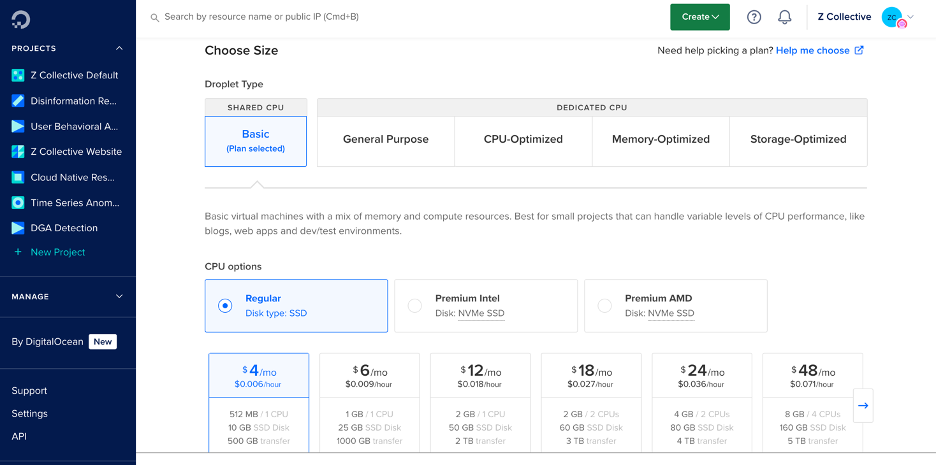

[](https://classroom.github.com/a/oF-d3MHd)
# Week 2 Assignment: Run Jupyter on a Remote VM

By the end of this assignment, you will have:

1. Created your first virtual machine on DigitalOcean both in the console and using the DigitalOcean CLI tool
2. Learned the basics of interacting with your droplet
3. Connected to your droplet using SSH
4. Deployed a Jupyter server on your droplet
5. Securely accessed your Jupyter notebook using SSH

# Part 1: Create a Virtual Machine

First, we will create a virtual machine on DigitalOcean infrastructure. Virtual machines (or VMs) on DigitalOcean are known as “droplets”. In part 1A, you’ll create a Droplet on DigitalOcean using the cloud console.

## Part 1a: Create a VM on DigitalOcean

**Step 1:** 

Sign in to your DigitalOcean account (https://cloud.digitalocean.com)

**Step 2:** 

Navigate to your project and click on **Create**


**Step 3:** 

Select **Droplet** from the drop down menu


**Step 4:**

Choose a Region  and select a Datacenter


**Step 5:** 

Choose an image


**Step 6:** 

Choose a size according to your project requirements. In this case, just select “Regular” and the smallest droplet size available. (We’re going to be deleting this droplet soon after we create it!)



**Step 7:** 

Add an existing SSH key. If there is none, create a new SSH key and add as shown in step 8.


**Step 8:** 

Generate and add a new SSH key. We created SSH keys in Assignment 1- please refer back to the documentation for assignment 1 if you need assistance with this step!


**Step 9:** 

Review all the chosen settings and click on “Create Droplet”. A new droplet has been successfully created.


## Part 1b: Interacting with and destroy your droplet

**Step 1:**

Now, we’ll use the cloud console to interact with our droplet. Once your droplet has been created, you’ll be taken to the Droplets page, where you can see all available droplets for your account. 


Click on the droplet you created. Once it’s been fully instantiated, you’ll be able to access it. 

In the droplet details page, select “Access” on the left-hand navigation. 


Click on “Launch Droplet Console”. Your access will be configured with the SSH key you specified. A new browser window will launch and you’ll have successfully connected to your droplet! You should see a window that looks like this:


**Step 2:** 

Feel free to do whatever you’d like on your droplet! This is a great opportunity to practice some of your *nix commands. If you’d like to review some basic commands on Linux, there are several great tutorials you can follow, ranging from 10 minutes to 3 hours to complete. Here are a few that I recommend:

1. https://ubuntu.com/tutorials/command-line-for-beginners#1-overview
2. https://www.freecodecamp.org/news/the-linux-commands-handbook/
3. https://www.digitalocean.com/community/tutorials/linux-commands

**Step 3:**

Once you’re done playing around with your droplet, you can delete it. Close the browser window that provided terminal access.

Back in the droplet details, go to the left-hand navigation, and select “Destroy”.


Now select “Destroy this Droplet”.

In the dialog box that opens, enter the name of the droplet and click on “Destroy”. 

# Part 2: Create a droplet using the DigitalOcean CLI

There’s more than one way to create virtual machines, whether you’re creating them in DigitalOcean, AWS, GCP, or Azure. Over this semester, we’ll learn how to create cloud resources using the cloud console, the command line interface (CLI), with APIs, and using Infrastructure as Code (IaC). In this part of the assignment, we’ll set up the DigitalOcean CLI (**doctl**) and start creating cloud resources programmatically.

### **Part 2a: Install doctl**

**Step 1:** 

First, we need to install doctl on our local machines:

**MacOS (using Homebrew)**

```bash
brew install doctl
```

**Windows (using GitHub Download)**

To download the most recent version of doctl open PowerShell and then run:

```powershell
Invoke-WebRequest https://github.com/digitalocean/doctl/releases/download/v1.104.0/doctl-1.104.0-windows-amd64.zip -OutFile ~\doctl-1.104.0-windows-amd64.zip
```

Next, extract the binary by running:

```powershell
Expand-Archive -Path ~\doctl-1.104.0-windows-amd64.zip
```

Finally, in a PowerShell terminal opened with **Run as Administrator**, move the doctl binary into a dedicated directory and add it to your system’s path: 

```powershell
New-Item -ItemType Directory $env:ProgramFiles\doctl\
Move-Item -Path ~\doctl-1.104.0-windows-amd64\doctl.exe -Destination $env:ProgramFiles\doctl\
[Environment]::SetEnvironmentVariable(
    "Path",
    [Environment]::GetEnvironmentVariable("Path",
    [EnvironmentVariableTarget]::Machine) + ";$env:ProgramFiles\doctl\",
    [EnvironmentVariableTarget]::Machine)
$env:Path = [System.Environment]::GetEnvironmentVariable("Path","Machine")
```

### **Part 2b: Create an API Token**

**Step 1:**

You’ll need a personal access token in order to authenticate what you send from your command line to DigitalOcean. 

<aside>
💡 Keep your tokens secret! Tokens function like passwords. You never want to hard code a token into a program where it could be seen by others (e.g., don’t add tokens into your code and commit the code to a shared repository). If others can access your token, they can access anything you allowed your token to access/do, including deleting your resources and creating new resources (which you’ll be billed for!).

Token access can be scoped to only perform specific tasks. For example, you can limit a token’s ability to interact with your cloud environment by only adding “Read” permissions to it. This lets you secure your workflows by granting only the permissions the token needs and restricting access to other resources and actions. ***Note: we call this the principle of least privilege- we only allow tokens, applications, and people to have access to the things they need to do and use to get their jobs done, no more and no less.*** 

Token scopes have different levels of granularity across different cloud providers. For our tokens, we have four broad capabilities:

- Create: Create the resource type and perform additive actions within that resource type. `database:create` access lets you create database clusters and create new users or databases within that cluster.
- Read: Read lets you view information about a resource by type and also view information that the resource returns. `app:read` lets you view App Platform apps and their logs.
- Update: Update allows you to modify a resource type and perform actions that would otherwise modify a resource. `droplet:update` lets you power a Droplet on or off.
- Delete: Delete lets you delete a resource by type and perform actions that delete information about the resource type. `database:delete` lets you delete databases from a database cluster and remove existing users from a database.
</aside>

To generate a personal access token, log in to the DigitalOcean Control Panel. 

In the left menu, click **API**, which takes you to the **Applications & API** page on the **Tokens** tab. In the **Personal access tokens** section, click the **Generate New Token** button.


On the **Create A New Personal Access Token** page, fill out the fields:

- **Token name**. Choose a name for the token. Please the following convention:
    - firstname_lastname_PAT
- **Expiration**. Choose when the token expires. After the interval passes, the token can no longer authenticate you to the API and it disappears from your account.
    - Select 1 year for your PAT expiration date
- **Scopes**. Choose the permissions that define which resources and actions the token can access.
    - **Custom Scopes** lets you select from the full list of available scopes.
    - **Read Only**, previously read scope, lets the token list and retrieve information from all resources, both existing and new.
    - **Full Access** lets the token view, modify, and delete all resources, both existing and new.

You can use the **Quick bulk scope select** to select all scopes for any CRUD action, **Search by resource type** to look for a scope by name, or select and expand sections in the full list:


The bottom of the page displays the summary of custom chosen scopes. When you finish selecting your options, click **Generate Token** to create the token and return to the **Applications & API** page. **Save the displayed token. For security purposes, the secret is only shown once.**

If you try to use a token to call an endpoint that requires a scope the token does not have, the API returns a 403 Forbidden response.

> When using API tokens, it’s important to only grant the token access to exactly what it needs, and no more. This is called the **principle of least privilege**. Since we will be using our API tokens throughout the course to create, update, delete, and modify many kinds of resources, you can create your user token with Full Access. 
With great power comes great responsibility. Always double and triple check your commands before you run them to reduce the risk of inadvertently deleting your cloud resources!
> 

### Part 2c: Use the API token to grant account access to doctl

**Step 1:**

Use the API token to grant doctl access to the class’s DigitalOcean account. First, we will authenticate doctl using:

```powershell
doctl auth init
```

You’ll be prompted to pass in the token string. Pass in the token string that was generated when you created your access token and hit enter.

**Step 2:**

Next we’ll set a context for this token. A context lets you keep track of multiple authenticated accounts. Give your context a name that makes sense for you. For example, it could be `assignments` . 

```powershell
doctl auth init --context <NAME>
```

You may wish to create a separate context for your group project, in case you want to scope that token with different access. 

You can view all of the authentication contexts you have added to your machine by running

```powershell
doctl auth list
```

…and you can switch between contexts by running

```powershell
doctl auth switch --context <NAME>
```

Step 3: 

To confirm that you’ve successfully authorized, review your account details by running:

```powershell
doctl account get
```

You should see information for the course account returned.

## Part 2d: Create a Droplet Using doctl

**Step 1:**

Now that we’ve set up the doctl command line interface tool, as well as created a personal access token and authenticated to the class account, we can create droplets from our command lines! 

Let’s run a command to see what images and sizes we have available to us to create:

```bash
doctl compute size list
```

**Step 2:**

Now lets’ create a droplet! Since we’ll be using SSH to connect to our droplet, we need to make sure we have an SSH key **fingerprint** available to pass to the command. 

We’ve already covered SSH keys and generating them in Assignment 1, and you should already have an SSH key in your GitHub account. Now we’ll add an SSH key to our DigitalOcean account.

First, navigate to the cloud console (cloud.digitalocean.com) and sign in. On the left-hand navigation, scroll all the way down until you see “Settings”.

Click on the “Security” tab, and then select the button that says “Add SSH Key”:


**Create a new SSH key specifically for your use of the DO cloud account.**

Note that you’ll need to create a unique name for your SSH key so that your GitHub SSH key isn’t overwritten! 

1. Open a terminal or command prompt and type `ssh-keygen` 
2. When you’re prompted to enter a file to save the ssh key, the SSH agent will prompt you to use the default file name. You’ll want to keep the path but change the last part of it:

For example, ***if you’re on macOS*,** the output of running ssh-keygen may look like this:

```bash
zara@Zs-MacBook-Pro ~ % ssh-keygen
Generating public/private rsa key pair.
Enter file in which to save the key (/Users/zara/.ssh/id_rsa): 
```

You may wish to enter a file name like this:

```bash
zara@Zs-MacBook-Pro ~ % ssh-keygen
Generating public/private rsa key pair.
Enter file in which to save the key (/Users/zara/.ssh/id_rsa): /Users/zara/.ssh/digitalocean_key
```

Hit enter. You’ll be prompted for a password- this isn’t necessary, but if you do set a password you will be prompted to enter it whenever you use this SSH key.

When you click on “Add SSH key”, you’ll receive the following dialog: 

<aside>
💡 It is best practice to not reuse SSH keys across multiple services! You can keep track of your SSH keys using an ssh config file.

</aside>


You want to paste your **Public** key into the Pubic Key box. You can grab your pubic key’s contents by running the following command:

**MacOS**

```bash
cat /path/to/.ssh/digitalocean_key.pub
```

**Windows**

```bash
type /path/to/.ssh/digitalocean_key.pub
```

Copy and paste the text from your terminal into the Public Key box. 

Next, give your SSH key a unique name. Please follow this naming convention:

`firstname_lastname_ssh_key`

Click on “Add SSH Key” to finish adding your key. 

Now all we need to do is grab either the numeric ID or fingerprint of the SSH key you created. To find a list of ssh keys on the account, run: 

```powershell
doctl compute ssh-key list
```

Find the ID or fingerprint of the SSH key you added to the account, and have it ready for the next command. 

Copy the command below, and replace **<DROPLET-NAME>** with something you can identify as your own. For example: `professor-zara-assignment-2` . This will help us when it comes time to delete our droplet! 

**Mac**
```bash
doctl compute droplet create \
		-- ssh-keys <**SSH Key ID or SSH Key fingerprint here omit angle brackets>**
    --image ubuntu-24-04-x64 \
    --size s-1vcpu-1gb \
    --region sfo3 \
    <**droplet name here omit angle brackets**>
```
**Windows**

```bash
 & "doctl" compute droplet create my-droplet `
   --ssh-keys <**SSH Key ID or SSH Key fingerprint here omit angle brackets>** `
   --image ubuntu-24-04-x64 `
   --size s-1vcpu-1gb `
   --region sfo3 `
   <**droplet name here omit angle brackets**>
```

If you’re successful in creating a droplet, you’ll get an output similar to this: 

```bash
zara@Zs-MacBook-Pro ~ % doctl compute droplet create --region sfo2 --ssh-keys 43231567 --image ubuntu-24-04-x64 --size s-1vcpu-1gb professor-zara-assignment-2
ID           Name                           Public IPv4    Private IPv4    Public IPv6    Memory    VCPUs    Disk    Region    Image                     VPC UUID    Status    Tags    Features         Volumes
442451208    professor-zara-assignment-2                                                  1024      1        25      sfo2      Ubuntu 24.04 (LTS) x64                new               droplet_agent   
```

**Step 3:**

Try running the following command to get a full list of available Droplets in our account:

```powershell
doctl compute droplet list
```

You should see your newly created droplet listed! The output of the above command is going to include an ****ID** column with the Droplet you just created, alongside the name of the droplet you created. You’ll want to note the IP address assigned to your droplet so that you can SSH to it!

If there’s no Public IPv4 address listed yet (as in the example above!), give it a few minutes and then rerun `doctl compute droplet list`. It can take a few minutes to generate the IP address.

Eventually, you’ll see your Public IPv4 address!

```bash
zara@Zs-MacBook-Pro ~ % doctl compute droplet list
ID           Name                           Public IPv4       Private IPv4    Public IPv6    Memory    VCPUs    Disk    Region    Image                     VPC UUID                                Status    Tags    Features                            Volumes
442451208    professor-zara-assignment-2    138.197.192.30    10.120.0.2                     1024      1        25      sfo2      Ubuntu 24.04 (LTS) x64    ee28ba12-5588-4573-978a-11c7d29f3c6e    active            droplet_agent,private_networking    

```

## Part 2e: Connect to your Droplet Using SSH

Now we can connect to our Droplet using ssh! 

<aside>
💡 For Windows users: you can follow [Microsoft’s documentation](https://learn.microsoft.com/en-us/windows-server/administration/openssh/openssh_install_firstuse?tabs=gui) for installing OpenSSH for PowerShell, or you can use [PuTTy to SSH](https://www.notion.so/Connecting-to-a-Remote-Virtual-Machine-Droplet-Using-VSCode-Remote-Explorer-00b550f7e0624419b8d2833d713084af?pvs=21)! Up to you!

</aside>

**Step 1:**

Run the following command, replacing the IP address with the IP address of the droplet you created. You will also need to specify the path of your private key using the `-i` flag, as in

`ssh -i /path/to/private/key username@203.0.113.0`

```powershell
ssh -i /path/to/private/key root@**<IP.ADDRESS.HERE>**
```

Alternatively, you can SSH to your droplet using **doctl**:

```powershell
doctl compute ssh **<droplet-id OR droplet name>**
```

<aside>
💡 note that you can update your ~/.ssh/config file to specify which private ssh key to use to access the droplet you created! This can be very helpful if you end up using many ssh keys from your local dev environment!

</aside>

When you connect, you’ll get the following message:

```bash
The authenticity of <IP address> can’t be established. 

ED25519 key fingerprint is SHA256:<long hash of the ssh key fingerprint here>

This key is not known by any other names.

Are you sure you want to continue connecting? (yes/no/[fingerprint])
```

Type in `yes`

Your terminal should now show that you are logged in to your remote machine!! You can tell because the shell command will start with:

```bash
root@<your_droplet_name_here>
```

Congratulations! You’re now connected to your droplet!

# Part 3: Install Required Packages to Launch a Jupyter Server on your Droplet

Now it’s time to do something with our virtual machine! Let’s say you’re working on training a machine learning model and you’ve immediately run out of memory on your local laptop. You’d like to run this in the cloud, but some of the existing Jupyter notebook UIs don’t allow enough memory, CPU, GPU, or training time in their free offerings. You’d like an affordable option for completing your model training, without timeouts, expensive subscriptions, etc. Here’s how you can do that by running Jupyter on a virtual server! 

Step 1:

First, we’ll need to install our dependencies. Maybe you already have a Python requirements.txt file, or maybe you don’t. Either way, you’ll need to download and install the needed packages and libraries to run your code on the virtual server. 

These can include:

- Python3
- pyenv
- And we’ll of course need to install Jupyter so that we can run a notebook.

The image we used to create our virtual machine already comes with python3! (You may wish to set up a virtual environment if you’re intending on using this VM for other purposes, but for now, we can skip that.) You can check to see if there’s an existing installation of a library in the VM’s PATH by typing:

```bash
which python3
```

This should return the location of the python3 binary.

You can also run

```bash
python3 --version
```

To check which version of python is installed. The image we created has an up-to-date version of python, so we don’t need to worry about using pyenv to install a new one. 

Step 2: 

We need to install our dependencies using the Debian package manager, called **apt.** APT stands for Advanced Packaging Tool ****

(Recall from Lecture 2 that Ubuntu is a downstream distro in the Debian family! Therefore, Ubuntu uses the same **apt** package manager).

Whenever we spin up a new machine from an existing base image, we first need to run updates on it. We can do that in Debian-based distros (like Ubuntu) by running:

```bash
sudo apt update
```

(Note that, because we are logged in as `root`, we already have sudo permissions. sudo stands for **substitute user do** but in early days, we thought of it as **superuser do** because sudo granted superuser permissions to any command you ran. Now you can use sudo with more granularity and run commands as a member of any arbitrary group.)

This command updates the list of available packages to update. We now need to run the following in order to actually download and install those updated packages. 

```bash
sudo apt upgrade
```

You’ll be prompted to confirm if you want to upgrade the listed packages (by my recent count it was 123 packages). Press `Y` to install or `n` to abort. 

The upgrade may take some time to complete. 

<aside>
💡 If you are prompted to update the local ssh server, select the option to keep the currently installed one for now!

</aside>

Step 3:

Install some custom package management tooling for Ubuntu

```bash
sudo apt install software-properties-common -y
```

```bash
sudo apt install -y make build-essential libssl-dev zlib1g-dev libbz2-dev libreadline-dev libsqlite3-dev wget curl llvm libncursesw5-dev xz-utils tk-dev libxml2-dev libxmlsec1-dev libffi-dev liblzma-dev

```

```bash
sudo add-apt-repository ppa:deadsnakes/ppa
```

Step 4:

Next we’ll install pyenv using curl

<aside>
💡 The command below is going to curl the content at https://pyenv.run; that is going to grab the script located [here](https://raw.githubusercontent.com/pyenv/pyenv-installer/master/bin/pyenv-installer) . It’s going to then “pipe” that script (using the `|` character) to bash, which is the program running in your terminal! Then bash will execute the script 🙂. Under the hood it’s just lots of checking your local environment, cloning GitHub repos and branches, and then copying them into specified locations on your VM!

</aside>

```bash
curl https://pyenv.run | bash
```

We need to set our path so that we can use pyenv! 

```bash
nano ~/.bashrc
```

Use your arrow keys to move the cursor all the way to the bottom line of the ~/.profile file. Then copy the below code and paste it at the bottom of your ~/.profile:

```bash
export PYENV_ROOT="$HOME/.pyenv"
export PATH="$PYENV_ROOT/bin:$PATH"
eval "$(pyenv init --path)"
eval "$(pyenv init -)"
```

Now type `CTRL+S`  to save the file and then `CTRL+X`  to exit nano.

<aside>
💡 A note about nano: 
Think of nano as an in-terminal text editor. There are others, notably vim and vi. Where possible, we’ll use nano in this class. Vim gets pretty complicated pretty quickly, and honestly I don’t think I’d be much help with debugging vim issues! 

There are other ways of appending text to the end of a file without using nano or vim! For example, the code below is going to use echo to write to the end of the ~/.bashrc file:

```bash
echo -e 'export PYENV_ROOT="$HOME/.pyenv"\nexport PATH="$PYENV_ROOT/bin:$PATH"' >> ~/.bashrc
echo -e 'eval "$(pyenv init --path)"\neval "$(pyenv init -)"' >> ~/.bashrc
```

</aside>

Now we want to restart the shell by running:

```bash
exec "$SHELL"
```

Confirm that pyenv is installed by running

```bash
pyenv --version
```

Step 5:

Update pyenv using:

```bash
pyenv update
```

Next, install python version 3.12.0, just for fun (if you followed the instructions for the VM image, you will already have python 3.12.3 installed! Installing 3.12.0 is completely arbitrary; it’s just to get the hang of using pyenv)

```bash
pyenv install 3.12.0
```

Now run `pyenv versions` to see a list of all the python versions that are installed on your VM. The output should look like the below:

```bash
root@professor-zara-assignment-2:# pyenv versions
* system (set by /root/.pyenv/version)
  3.12.0
```

Step 6:

Let’s create a virtual environment for our Jupyter server project. Python virtual environments help us to isolate dependencies for different projects, so that we don’t end up with conflicting dependencies and end up in the dreaded Python `dependency hell` 

We’ll use virtualenv for this. The command below creates a new virtual environment based off of the python 3.12.0 version available globally on your machine.

```bash
pyenv virtualenv 3.12.0 jupyter-server
```

Run `pyenv versions` again. Your output should look like this:

```bash
* system (set by /root/.pyenv/version)
  3.12.0
  3.12.0/envs/jupyter-server
  jupyter-server --> /root/.pyenv/versions/3.12.0/envs/jupyter-server
```

Step 7:

Now let’s create a working directory for our assignment: 

```bash
mkdir assignment-2
```

Then, we’ll cd into it:

```bash
cd assignment-2
```

We’ll set our this directory to use our jupyter-server virtual environment:

```bash
pyenv local jupyter-server
```

Note that our shell is now prepended with our environment!

```bash
(jupyter-server) root@professor-zara-assignment-2:~/assignment-2#
```

Step 8:

Let’s start installing packages! First things first, let’s upgrade pip: 

```powershell
pip install --upgrade pip
```

Now we’ll install our dependencies (just jupyterlab for now!)

```powershell
pip install jupyterlab 
```

Step 9:

Let’s try running jupyter! 

```bash
jupyter lab --allow-root
```

You’ll see output that looks like the following:

```bash
[I 2024-09-01 05:24:52.663 ServerApp] Jupyter Server 2.14.2 is running at:
[I 2024-09-01 05:24:52.663 ServerApp] http://localhost:8888/lab?token=e20a646d97fc88e8b175b205f887bcc97f7160528e7ad4d4
[I 2024-09-01 05:24:52.663 ServerApp]     http://127.0.0.1:8888/lab?token=e20a646d97fc88e8b175b205f887bcc97f7160528e7ad4d4
[I 2024-09-01 05:24:52.663 ServerApp] Use Control-C to stop this server and shut down all kernels (twice to skip confirmation).
[W 2024-09-01 05:24:52.675 ServerApp] No web browser found: Error('could not locate runnable browser').
```

A few things to call out:

1. Jupyter Server tells us that the server can be accessed at [http://localhost:8888/lab](http://localhost:8888/lab) 
    1. [localhost](http://localhost) is also 127.0.0.1 (we’ll cover this in more detail during our networking unit!)
2. There is a token appended to the end of the URL (it starts with token=)
    1. Jupyter supports two authentication methods: token-based and password based. We’ll use the token for now!
3. Note that Jupyter server has an error: “No web browser found”. That’s because in cloud world, we don’t interact with our servers through UIs other than our terminal! 

So how are we going to view the Jupyter Notebook UI? We want to be able to write code in our notebook so that we can train our model! How can we do that if we only have access to a terminal on our droplet? 

Luckily, there are a few options for this. We’re going to go over one of them.

Step 10:

### Part 3a. Using SSH Tunneling to Connect to Your Jupyter Server Installation

Jupyter runs its browser interface on a specific port on your remote server (usually :8888). This port isn’t exposed to the broader web by default. **SSH tunneling** lets us securely connect to remote server ports, which we can then access using a local web browser. 

Step 1:

Let’s first quit our Jupyter server by typing `CTRL+C` . You’ll be prompted if you’re sure you want to quit. 

Now let’s exit our current SSH session. Type `exit` .

Step 2: 

We’ll restart our SSH session, but with some modifications.

The commands below should look familiar- they’re not unlike the commands we ran to SSH to our virtual machine! Note that we’ve added a few new parameters in the ssh command. (Remember to pass the `-i <ssh_private_key_file>` parameter if you have multiple SSH keys and haven’t set up your ssh config file to reference this host.

<aside>
💡 Hint: now that you’ve exited your SSH shell, you’re back to using the commands on your local machine! If you leave this window open, then you can use the up arrow to see previous commands you’ve run. You can find the first ssh command you ran, and just add the -L 8888:localhost:8888 part to the command!

</aside>

```bash
ssh -i <ssh_private_key_file> -L 8888:localhost:8888 root@your_server_ip
```

The `-L` parameter specifies that the given port on the local (client) host is to be forwarded to the given host and port on the remote (server) side. This means that whatever is running on the second port number (in our case, 8888) on the server will appear on the first port number (8888) on our local computer. 

So, the syntax reflects this meaning:

`-L <local_port_number>:localhost:<server_port_number>`

Step 3:

Once you have successfully SSH’d to your remote machine, you can launch Jupyter again by running the following command on your remote machine: 

First, cd into the project directory:

```bash
cd assignment-2
```

Now run: 

```powershell
jupyter lab --allow-root
```

Once again, we want to look at the output of running the command. There will be a URL that includes a token at the end of it (it should start with [http://localhost:8888](http://localhost:8888) or [http://127.0.0.1:8888](http://127.0.0.1:8888) and will be followed by a long string of characters.) 

Step 4:

Copy the full URL (including the characters all the way to the end). On your local machine, open a web browser and paste in the URL. 

You should now be able to see a Jupyter notebook running! You can interact with it just as if it were running locally! 

# Deliverables:

1. Your instructor and TA will inspect the cloud console to make sure that the following resources are present:
    1. An API token with your name
    2. An SSH key with your name
    3. A droplet with your name (I can tell on the backend if you created it via the CLI!)
2. Please paste the link to your Jupyter lab URL that you copied to run locally.

<aside>
💡 Copy and paste the link to your Jupyter notebook here:

1. http://localhost:8888/lab/tree/Untitled.ipynb
2. http://127.0.0.1:8888/lab/tree/Untitled1.ipynb

</aside>

1. If you would like to keep this droplet running, you are welcome to do so! Note that when you close your SSH session, the Jupyter server will stop running- you’ll just need to SSH to it again using the `-L`  argument, cd into your assignment directory, and run `jupyter-lab --allow-root` 
2. If you do not wish to keep your droplet running, you can destroy it after this assignment is graded. 
3. Commit this assignment back to your repo, and make sure to link to the repo in the D2L assignment page! 

Congratulations, you’ve completed Assignment 2! You’ve done the following:

1. Learned the basics of the DigitalOcean cloud console
2. Learned some basic commands for working with the DO command line interface (CLI)
3. Added an API token
4. Added your SSH keys
5. Connected to your droplet using SSH
6. Installed python dependency management tooling on Ubuntu
7. Installed Jupyter Lab
8. Allowed SSH tunneling to be able to interact with a remote Jupyter notebook from your local machine!
