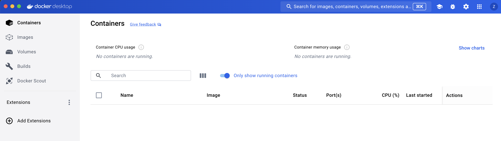
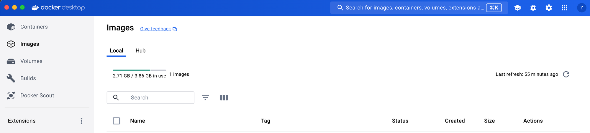
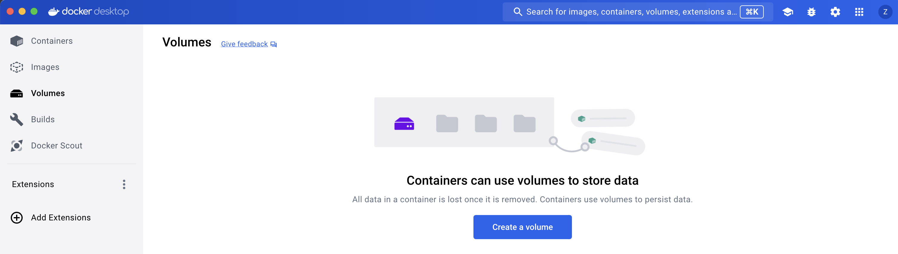
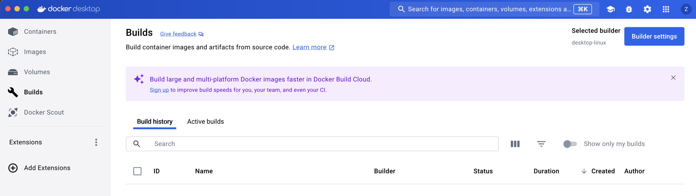
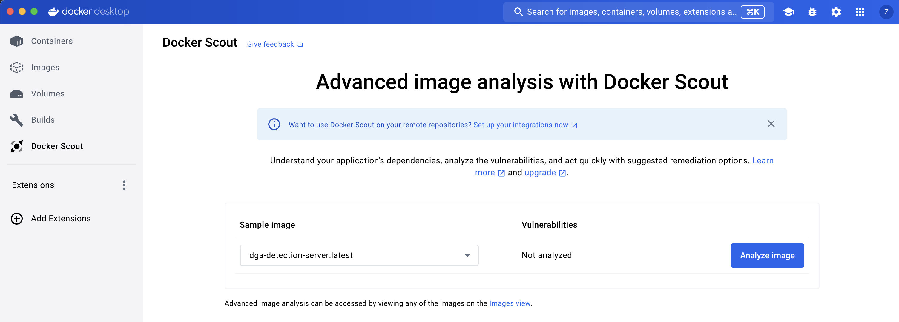

# Part 2: Explore Docker Desktop

<aside>
💡

**A note for Windows users:**

You may need to enable WSL for Docker Desktop. Please see the instructions here:

- [https://docs.docker.com/desktop/wsl/](https://docs.docker.com/desktop/wsl/)
</aside>

This is just a quick tour of Docker Desktop. Docker Desktop provides a helpful UI for understanding the images you have available locally, any running or exited containers on your machine, mounted volumes, and more. Let’s take a quick tour of Docker Desktop.

## Part 1: Launch Docker Desktop and Sign-In

1. First, you’ll need to launch Docker Desktop. 
2. If prompted to sign-in, use the Docker Hub account that you created in Assignment 1
3. When Docker Desktop launches, you’re presented with a dashboard Window. 

This is where you can see any containers that are running or stopped on your machine. 

## Part 2: Tour Docker Desktop

1. Click on “Images” in the left-hand navigation. If you’re following this part after working through “Docker First Steps”, then you should see an alpine linux image listed here.

Images show you any images that are available locally (in the local tab) or available in your Docker Hub registry (Hub). Your registry will likely be empty. It will be empty until you publish an image to Docker Hub.

1. Click on “Volumes” in the left-hand navigation:

Volumes are persistent storage that your containers can access when they’re running. We haven’t created any volumes yet, so this will still be empty. When you create a volume, you can attach your container(s) to it.

1. Click on “Builds” in the left-hand navigation:

When you build an image, the build will show up in the Build section. Docker Desktop shows you helpful metrics about your build, including the amount of time it took to complete, the status, when it was created, etc.

1. Click on “Docker Scout” in the left-hand navigation:

Docker Scout gives you image analytics. In particular, Docker Scout shows you the layers of your image, and any security vulnerabilities that might go along with them. If you’re following this walk-through after working through the Docker First Steps tutorial, you will have alpine linux available to analyze. Click on analyze image to see the output. 

Docker Desktop is a helpful way of interacting with the Docker engine. It’s extremely convenient, but be advised that when you’re running docker containers on your remote Linux virtual machines, you won’t be able to have a nice UI to guide you.